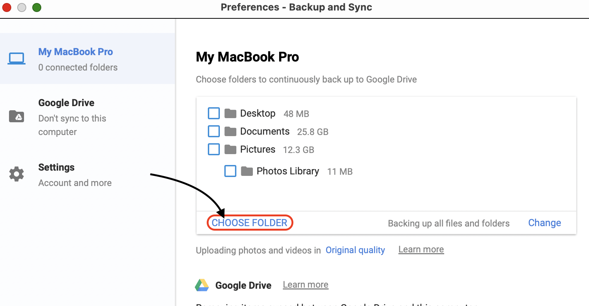
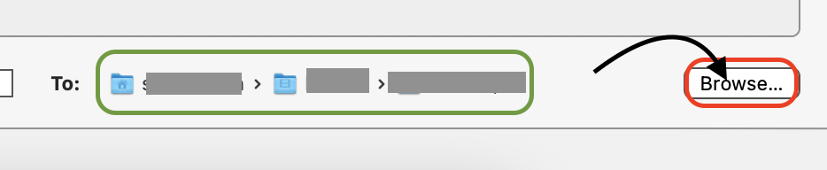
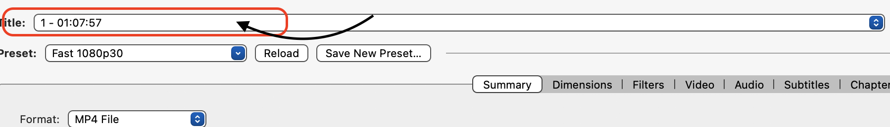

## Introduction

These instructions provide a step-by-step overview of how to transfer videos from physical DVD disks onto your computer and set them to automatically backup to a remote location. This introduction will help clarify some jargon and let you know what you need to get started.

**What is "ripping"? It sounds dangerous.** "Ripping" is the colloquial term for copying data from a physical storage unit, like DVDs, onto a computer. A common misconception is that ripping comes from the phrase "rip off." The exact origin of the term is unknown, but it likely comes from the sound made by disk drives. As long as the DVD you are copying does not have a copyright disclaimer, it is perfectly legal to rip its content.

**What is "the cloud" and why should I use it for backups?** "The cloud" typically refers to services that are running on computers owned by technology companies that you can access through the internet. Google Drive for example, is a cloud storage service. It allows you to send files to Google owned computers for permanent storage. This is a good idea because Google spends a lot more money on harddrives than you. They are able to store multiple copies of the files you send to them, so there is virtually no chance that a computer dying will cause Google to lose your data. On the other hand, if your computer dies and you did not set up a cloud backup, there is a very high chance that the majority of your files will be lost. So backup, and backup often!

**I have a lot of DVDs, will I be able to use my computer for other tasks while I'm ripping videos?** Yes, you will. In general, ripping is a low-resource operation. However, this process will occupy your disk drive, so you will be unable to read disks unless you have multiple drives.

### Materials

* Laptop \*
* Disk drive \*\*
* Google account: If you do not have a Google account you can set one up here: [https://www.google.com/account/about/](https://www.google.com/account/about/)
* Handbrake: Handbrake is a free open-source video transcoder available here: [https://handbrake.fr/](https://handbrake.fr/)
* Backup & Sync Google Drive: This is a free backup tool made by Google available here: [https://www.google.com/intl/en_gh/drive/download/](https://www.google.com/intl/en_gh/drive/download/)

\*These instructions will include screenshots from a Mac computer, however the steps will be almost identical for Windows machines

\*\*If your computer does not have a built-in disk drive, you will have to purchase an external disk drive. Here is a link to a somewhat pricier but reliable model available on Amazon: [https://www.amazon.com/ASUS-ZenDrive-External-Compatible-BackItUp/dp/B076CY7PW5](https://www.amazon.com/ASUS-ZenDrive-External-Compatible-BackItUp/dp/B076CY7PW5/ref=sxin_10)

## Instructions
### Part 1: Setup
The first step in this process is making sure that your equipment is working and setting up a file structure to keep everything organized.

1. **Test your DVD disk reader.** If you are using an external disk drive, make sure that the USB cable is firmly connected to your computer. Then insert any DVD into your disk drive. You will likely hear the disk spinning after a few seconds. Within 2 minutes, an icon will appear on your desktop.

*This disk icon indicates that your disk drive is working correctly*
2. **Create an output folder.** I strongly encourage that you designate a folder within your overall file structure for each large batch of DVD rips. My rule-of-thumb is to sort files by their type. That is, I store images in subfolders of My Pictures, audio in subfolders of My Music, etc. You may have your own structure, but I recommend creating a new folder in Movies with a descriptive name.

*I created a new folder in Movies called "Home Videos Collection 1990-1999."*

### Part 2: Configure Cloud Backup & Sync
Depending on how many DVDs you have to rip, you might want to work on this process over several days. Therefore, you should set up a cloud backup system before you begin ripping DVDs to minimize the risk of losing video files.
1. **Launch Backup & Sync Google Drive.**
Locate and launch the Google Drive backup tool using Launchpad.\
Click on the Launchpad icon on your dock

Locate and click on the Backup & Sync icon in Launchpad.

This icon will appear on your toolbar once Backup & Sync launches.

2. **Add your output folder to Backup & Sync automatic backups.**\
Right-click the Backup & Sync icon on your toolbar.

Then, left-click the three dots in the upper right-hand corner of the dialog (1) and select "Preferences..."(2)

In the first tab, click on the button labeled "Choose Folder."

Next, navigate to the folder you created in Part 1 Step 2 and press "Open".

You should now see your folder under "Choose folders to continuously backup to Google Drive." Press "OK" to exit the Preferences dialog.

### Rip DVDs
Now that your output folder is configured to automatically sync with your Google Drive, it's time to start ripping DVDs. Repeat this part of the instructions for *each DVD*.
1. **Launch Handbrake.** Launch Handbrake using Launchpad.

Locate and click on the Handbrake icon in Launchpad.

2. **Insert the DVD into your disk drive.**
3. **Open the DVD in Handbrake.**\
Select "Open Source" in the upper left-hand corner of Handbrake.

Under "Volumes" select the DVD icon and press "Open"

4. **Select your output folder.**
If the folder displayed on the lower right-hand corner of Handbrake does not match the folder you created in Part 1 Step 2, press the "Browse" button.

Then, navigate to your output folder and press "Open"

5. **Add each track to the rip queue.**
Select a title for the current DVD. Enter this title into the "Save As" field on the bottom of Handbrake followed by "\_1".

Next press "Add To Queue" at the top of Handbrake

Now iterate through each track on the DVD by selecting the "Title" field at the top of Handbrake

Select the next available track.

Increment the tag at the end of the title in "Save As"

Press "Add To Queue"
6. **Start the rip queue.**
Press the "Start Queue" button at the top of Handbrake.

"Encode Finished" will appear on the bottom left-hand corner of Handbrake once your rip is complete

## Troubleshooting
### Troubleshooting Setup
**I don't see a DVD icon appear on my desktop when I plug in my DVD disk drive.** First, make sure that there is a DVD in the drive. If there is, try opening and closing the disk drive. You can try listening to the drive itself. After a few seconds, most drives will start to spin smoothly. If the drive sounds like it is stuttering, its motor may be failing. If you are using an external DVD drive, make sure that the USB port it is connected to is working. You can test this by connecting another USB device such as a to the same USB port and verifying that it acts according to its default behavior.
### Troubleshooting Backup & Sync
**Backup & Sync is asking me to log in to something.** The first time you use Backup & Sync Google Drive, it will ask you to log in to your Google account. This is normal. You should simply follow the prompts to log in to your Google account.
### Troubleshooting Handbrake
**I got a popup about copyright violations after I selected my DVD in open source. Should I be worried?** You shouldn't necessarily be worried. Handbrake will issue that message when you are trying to copy from a copy-protected DVD. A DVD could be copy-protected for a number of reasons and it is not necessarily illegal to rip a copy-protected DVD. If you recorded the DVD yourself, it is most likely legal to rip its contents.
**Nothing happens when I click "Add To Queue"** You can view the queue on the upper right-hand corner of Handbrake to verify that the track has been added to the rip queue.
## Summary
These instructions provide step-by-step directions on how to rip DVDs and set them to automatically back up on Google Drive. Once you have completely transferred your home videos from physical disks onto Google Drive, you can view your files by navigating to [http://drive.google.com](http://drive.google.com). You should see your output folder under Computers \> Your Computer Name.

Lastly, feel free to look into Google Drive's sharing features to send these videos to your friends and family. 
